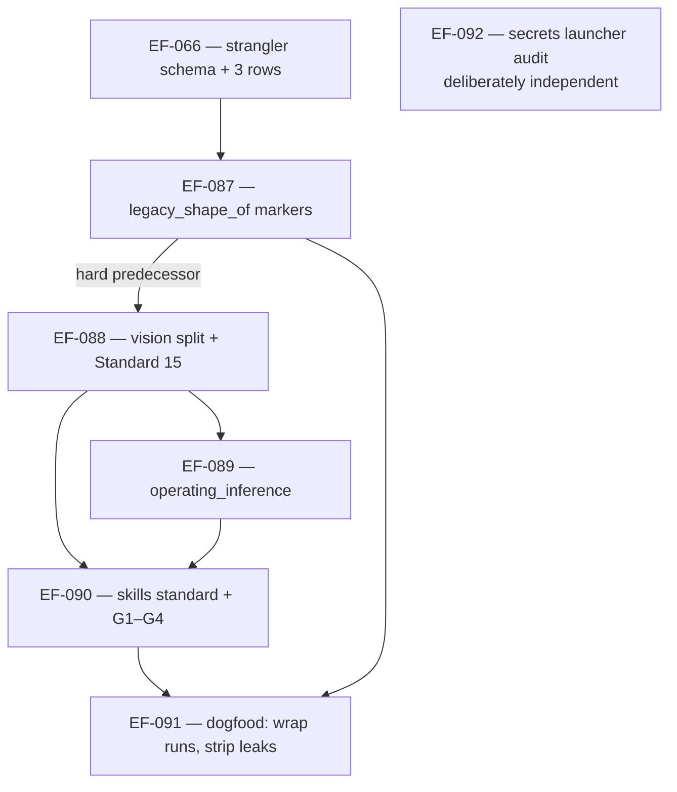

# Plan: Migration `procedure-skills-to-programs` (EF-086)

**Date:** 2026-09-07
**Status:** Filed; slice 0 not started
**Tracking:** EF-086 (owner). Children: EF-066, EF-087, EF-088, EF-089, EF-090, EF-091, EF-092
**Completion commitment:** 2027-03-31
**Related:** EF-062 (subsumed), EF-056 (Phase 0 master), EF-022 (adjacent), `02-roadmap/adoption-strategy.md`

## The problem

Conversational-first (vision principle 6, Standard 12) was written to stop premature UIs and
services. It then got applied to **factory and product procedures**: once the steps of a skill
or a runbook are known, agents keep those steps in prose and re-derive them every session.
That is more expensive to maintain than a program, and it hides the real code that already
lives under `.eposforge/**/scripts` and `skills/*/scripts`.

Standard 03 already says a skill is order, refusals, dry-run or a human gate over tools — not
the store verb. In practice procedure skills became the procedure: one skill embeds the whole
incremental-vs-full-rebuild recipe and invokes its script from an assumed cwd; another tells
the agent to run a backlog script from repo root; a third uses a home variable but with a
malformed path, so the "anchored" form does not resolve. Meanwhile `AGENTS.md` claims there is
no application code while listing several script trees.

## The split

| Domain | Default | Standard |
|---|---|---|
| Product UX | conversational first; GUI and API when use pulls them | 12 |
| Known procedures (factory or product) | program-first once the steps are known | 15 |

A skill or runbook wraps the program: when to invoke, dry-run, human gate and refusals, chair,
what "good" looks like. It MUST NOT be the only place the steps exist. Judgment stays in prose.

## Method: strangler, with visibility as the first slice

Method is strangler fig per `02-roadmap/adoption-strategy.md`. Do not invent a new migration
pattern. The four obligations map as:

| Obligation | How this migration meets it |
|---|---|
| Alignment | Every touched skill, runbook or program is delivered Standard 15-shaped. An exception is recorded as a shape label, not as silence. |
| Completion commitment | **2027-03-31**. "We'll get to it" is not a commitment. |
| Visibility of remaining debt | EF-066 (backlog fields + `--strangler` view) **and** EF-087 (`legacy_shape_of` on the files agents open) — both hard predecessors of EF-088. |
| Active balance | Opportunistic on touched skills, plus three bounded batches: the invocation-path ratchet (EF-090/EF-091), the inference-field allowlist (EF-089), the secrets launcher audit (EF-092). |

**Visibility is first because it has never actually worked.** Without it a program-first
strangler is invisible and an agent that opens a step-list skill will thicken it. Backlog
fields alone miss that agent; an always-loaded one-liner alone is the same class of prose that
already failed to stop the conversational-first misuse. Both, or neither counts.

## Order

Adopter overlays inherit after EF-088 and are ordered in their own backlogs; they must not
invent a second class table, and their identifiers stay out of this repo (EF-047).

## Encoding

Three rows, all generic, filed as part of EF-066:

| Role | Field | Item |
|---|---|---|
| Owner | `Migration: procedure-skills-to-programs` | EF-086 |
| Target shape | `TargetShapeOf: procedure-skills-to-programs` | EF-088 |
| Legacy shape | `LegacyShapeOf: procedure-skills-to-programs` | EF-091 |

The fields are added when EF-066 lands the schema, not before. Skill frontmatter labels
(EF-087) are a *separate* population and do not satisfy backlog lint. No item in this repo
points at an adopter's plan file.

## Scope of "done" at 2027-03-31

Pattern adopted; gates live; the known ugly paths strangled; remaining judgment skills still
skills. **Not** in scope: rewriting every `.sh` into a service, a UI or a service on day one
for every procedure, a hard language default anywhere in this repo, dual POSIX + PowerShell
implementations of shared programs, one factory-wide mega-library, born-public shared
libraries, or a ban on operating inference.

## Rollback

Standards and vision: revert the PR; principle 6 and Standard 12 return to today's text.
Gates: remove the checker from the pre-commit fragment and the required workflow; fixtures
stay in git history. Path fixes revert independently — they are alignment, not a cutover.
Schema fields are additive; rollback is "stop writing them" plus a lint flag-off. Do not
delete the fields from items without a replacement visibility story. **No feature flags** —
visibility behind a flag is not visibility.

## Risks

| Risk | Mitigation |
|---|---|
| Visibility does not land and agents thicken legacy skills | EF-066 + EF-087 are hard predecessors of EF-088. This failure mode is reported, not hypothetical. |
| Classification ignored ("quicker", "default") | G1, the class boundary rule, and the invalid-reasons sentence in the standard. |
| A public file leaks an adopter, host or instance identifier | Standard 08 requirement 5; EF-091 extends `check-sensitive-literals.sh` under `skills/`. |
| G2 false-positives on judgment skills, so someone disables the gate | Operator-reviewed examples first; warn → fail-new → fail-touched ratchet; explicit stay-skills list. |
| Completion date ignored in practice | Dated here; an active-balance owner is still required, and a date without the visibility slice will not be noticed. |
