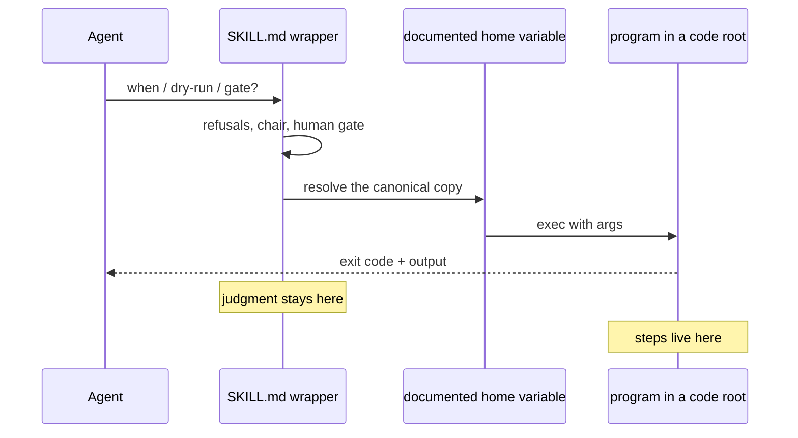

# Plan: Dogfood the migration on the known ugly paths (EF-091)

**Date:** 2026-09-07
**Status:** Open; follows EF-087, EF-089, EF-090
**Tracking:** EF-091 — the **invocation half** of EF-062, and the legacy shape of `procedure-skills-to-programs`
**Related:** EF-090 (the gates in fail-on-touched), EF-092 (secrets launchers, deliberately excluded)

## The shape being fixed

## The bounded batch

| Path | Class | Change |
|---|---|---|
| `skills/update-spec-graph/SKILL.md` | skill wrapping two programs | (1) Wrap **both** runs via the home variable: the incremental sync dispatch **and** the bulk-rebuild program. The inline git-diff recipe is the anti-pattern — the program already exists. (2) Keep only the path-choice table and the verify steps in the skill. (3) Strip the leaks on this public file: replace the instance URL and the host container names with generic placeholders or a pointer to a private runbook, the way the wipe block already does for compose paths. |
| `skills/upstream-bug-report/SKILL.md` | skill wrapping glue | Home variable for the new-issue program; filing the issue itself stays judgment. |
| `skills/portfolio-review/SKILL.md` | skill wrapping glue; judgment stays | Fix the malformed double-dot home path so the anchored form actually resolves; keep conceptual-model, supersession and vision-alignment as skill. |
| `AGENTS.md` | always-loaded | Replace the remaining cwd-relative examples. |
| Spec Graph Living Spec | capability | `operating_inference` if EF-089 did not already land it. |
| Strangled skills | frontmatter | Flip `legacy_shape_of` → `target_shape_of`. |

Classify every file this item touches with a `vehicle-class:` marker. For the Spec Graph
surface the classification is: the sync tool is `in-repo-pipeline`, the bulk-rebuild script is
`host-ci-glue`, and the skill wraps both — the incremental-vs-full *choice* is the judgment
that stays in prose.

## Leak checker extension

Extend `check-sensitive-literals.sh` so a hostname matching `\b[a-z0-9][a-z0-9-]*\.lan\b`
**under `skills/`** is a hard fail. That is the same regex the backlog lint already uses, and
the docs-lint skill's own `*.lan` rule text is safe under it. The existing leak in
`update-spec-graph/SKILL.md` is what proves the gap: the sensitive-literals checker does not
match `*.lan` today, and the backlog lint only scans backlog files.

**Do not fail-all the rest of the tree in this item.** Several historical files under `docs/`
are already red, and cleaning them is a separate follow-up. Fail-on-new outside `skills/` is
optional and safe.

## Explicitly out of scope

**Stay skills** — not part of this rewrite: milestone elicitation, prompt refinement, the
portfolio-review *judgment* steps, the docs-lint *semantic* half, the ontology-maintenance
editorial judgment. If any of them grows a mechanical half, extract only that half.

**Stay glue** — classify, do not promote to services: the bulk-rebuild script, the hook
composer, the hook installer, the backlog lint.

**Secrets launchers** are EF-092, not this item. Their `.sh`, `.ps1` and Python entrypoints
already disagree on layout, and one bad collapse breaks Windows Git Bash or a POSIX PATH. It
must not be able to revert the skill-path fixes.

This item does not rewrite every script in the tree. That was declined: it would break working
glue and skip classification.

## Done looks like

The remaining-debt view for this migration lists fewer legacy items than before, and the three
strangled skills no longer carry the legacy label.
